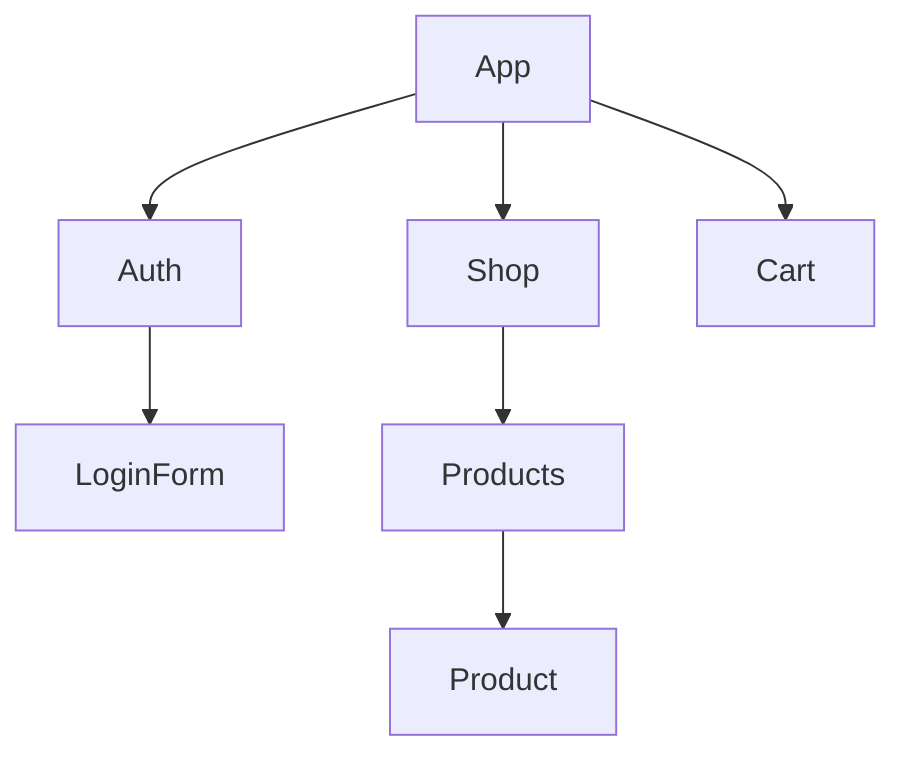

# udemy-react

> Section 10 (116-119): useReducer
> Section 10 (120-125): Context API

## useState vs. useReducer

There is no hard rule or clear wrong or right about when to use one or the other. But in general, you need to use `useReducer` if `useState` has become cumbersome or you're getting a lot of bugs or unintended behaviors.

<!-- prettier-ignore-start -->
| `useState` | `useReducer` |
| ----------- | ----------- |
| The primary state management tool. | Great if you need more 'power'. |
| Great for independent pieces of state/data. | Ideal when you have related pieces of state/data. |
| Great if state updates are easy and limited to a few kinds of updates. | Helpful when you have more complex state updates |
<!-- prettier-ignore-end -->

## Context API

The React context API allows you to avoid prop forwarding. It is component-wide, behind the scenes state storage.

For example, in the starter code of this project, the `<App />` component sent the `isLoggedIn` and `onLogout` props to `<MainHeader />`. That component has no use for those props, it only forwarded them to `<Navigation />`, where they are needed.

In a case as simple as this, that is not awful, but in more complex apps this pattern would become obnoxious very quickly.

### Slightly more complex example

Given a structure such as this:



The Cart component would likely need data from both the LoginForm and the Product components. But this component structure means there is no immediate connection between them.

Passing that data up through the tree and over and down into the Cart would be 🙄.

Using React context, that data can be made available to the Cart from its sibling/cousin components as needed.

### Solution

You can create any number of contexts (i.e. [src/store/auth-context.js](src/store/auth-context.js)).

```js
const AuthContext = React.createContext({
    isLoggedIn: false,
    onLogout: () => {},
});

export default AuthContext;
```

Import that context, and wrap any component which will need the values it provides. Notes:

-   children of the wrapped component can also access the provided values.
-   the wrapper around the element _providing_ the context to components must implement the `.Provider` element. `AuthContext` itself not a valid jsx element.
-   code not shown in this repo, but some of the logic and features can be moved to a custom content provider component; see lesson 124 for details.

```js
import AuthContext from './store/auth-context'

...

const [isLoggedIn, setIsLoggedIn] = useState(false)
...

return (
    <AuthContext.Provider value={{isLoggedIn, onLogout: logoutHandler}}>
      <MainHeader />
      <main>
        {!isLoggedIn && <Login onLogin={loginHandler} />}
        {isLoggedIn && <Home onLogout={logoutHandler} />}
      </main>
    </AuthContext.Provider>
  )
```

And the child component which requires the _provided_ value can now access it and _consume_ it directly, instead of the value being passed via props through the MainHeader, which did not have a need for it at all.

There are two viable options for consuming a context:

-   `useContext`
-   `<AuthContext.Consumer>`
    -   NOTE: this approach will work, but it is not the most elegant option. Generally, it is better to use the `useContext` hook.

```js
import AuthContext from '../../store/auth-context'
import {useContext} from 'react'

const Navigation = () => {
  // the useContext hook (best option)
  const context = useContext(AuthContext)

    return (
      // the .Consumer element (acceptable option)
        // <AuthContext.Consumer>
        //     {(context) => {
                return (
                    <nav className={classes.nav}>
                        <ul>
                            {context.isLoggedIn && (
                                <li>
                                    <a href="/">Users</a>
                                </li>
                            )}
                            {context.isLoggedIn && (
                                <li>
                                    <a href="/">Admin</a>
                                </li>
                            )}
                            {context.isLoggedIn && (
                                <li>
                                    <button onClick={context.onLogout}>
                                        Logout
                                    </button>
                                </li>
                            )}
                        </ul>
                    </nav>
                )
            // }}
        // </AuthContext.Consumer>
    )
}
```

### Limitations

Don't overuse Context. Things to keep in mind:

-   It is not optimized for high frequency changes.
    -   Values that change multiple times per second should not be managed via context.
    -   Redux is the tool for these kinds of changes, instead.
-   Context should not be used to replace all communications and props.
    -   Even short prop chains might be acceptable, evaluate on a case by case basis.
