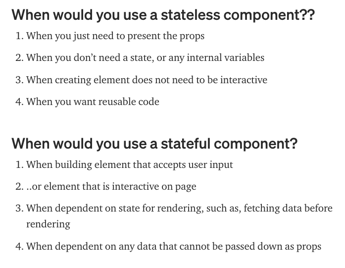

# TWO

> Covers sections 46-62

___
## Component Types

### Stateless vs. Stateful

Stateless components (i.e. ExpenseItem, ExpenseFilter) have no state.
- also called 'presentational' or 'dumb' components
- they primarily exist just to output data
- receive input via props
- in general, apps will have more stateless than stateful components, because they are more reuseable, and state will be passed via props.

Stateful components (i.e Expenses, ExpenseForm) depend on state.
- they can change their own state
- re-renders when the state changes
- can pass properties of that state to child components via props



[Source](https://medium.com/@cgcrutch18/stateful-vs-stateless-react-components-13f647f7fc4)

### Controlled vs. Uncontrolled

These are similar to Stateful vs. Stateless components, respectively.
- whenever you use two-way binding, you are effectively creating a controlled component
  - as in ExpensesFilter, the value which is displayed in the component is passed to and received from a parent component
  - the logic for which value to display is handled in Expenses
- 
___
## `useState(props.prop)`
```javascript
import React, { useState } from 'react'
```

`useState` is a React hook - [docs](https://reactjs.org/docs/hooks-state.html#declaring-a-state-variable)

Basic usage is in [Expenses/ExpenseItem.js](src/components/Expenses/ExpenseItem.js)

For managing multiple properties at once, alternate syntax (not commonly used):
```javascript
// _____ Most common approach: define props independently _____
// const [enteredTitle, setEnteredTitle] = useState('')
// const [enteredAmount, setEnteredAmount] = useState('')
// const [enteredDate, setEnteredDate] = useState('')

// const titleChangeHandler  = (e) => { setEnteredTitle(e.target.value) }
// const amountChangeHandler  = (e) => { setEnteredAmount(e.target.value) }
// const dateChangeHandler  = (e) => { setEnteredDate(e.target.value) }

// _____ Alternate syntax _____

// create reference
const [userInput, setUserInput] = useState({
    enteredTitle: '',
    enteredDate: '',
    enteredAmount: ''
})

// define method
const inputChangeHandler = (e) => {
    // _____ will usually work but but may fail (stale reference), bad practice _____
    // setUserInput({
    //     ...userInput,
    //     [e.target.id]: e.target.value
    // })

    // _____ preferred syntax when you must depend on previous state _____
    setUserInput((prevState) => {
        return { ...prevState, [e.target.id]: e.target.value }
    })
}

// set listeners
<div className="new-expense__control">
    <label>Title</label>
    <input id="enteredTitle" type="text" onChange={inputChangeHandler} />
</div>
<div className="new-expense__control">
    <label>Amount</label>
    <input id="enteredAmount" type="number" onChange={inputChangeHandler} min="0.01" step="0.01" />
</div>
<div className="new-expense__control">
    <label>Date</label>
    <input id="enteredDate" type="date" onChange={inputChangeHandler} min="2019-01-01" max="2022-12-31" />
</div>

```
